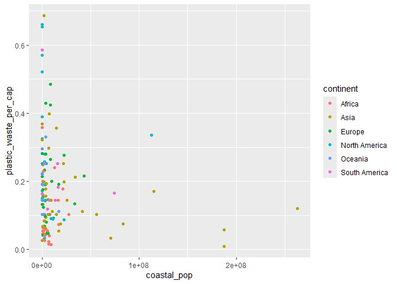

Lab 02 - Plastic waste
================
Malie Vigneux
22 septembre 2025

## Chargement des packages et des données

``` r
library(tidyverse) 
```

``` r
plastic_waste <- read_csv("data/plastic-waste.csv")
```

Commençons par filtrer les données pour retirer le point représenté par
Trinité et Tobago (TTO) qui est un outlier.

``` r
plastic_waste <- plastic_waste %>%
  filter(plastic_waste_per_cap < 3.5)
```

## Exercices

### Exercise 1

``` r
ggplot(plastic_waste, aes(x=plastic_waste_per_cap)) +
  geom_histogram(binwidth = 0.2) +
  facet_wrap(~continent)
```

<!-- -->

La plupart de ces continents ont des quatités importantes de déchets aux
alentours de 0.2 kg/jour par habitant. L’Afrique et l’Asie ont aussi de
grandes quatités de déchets inférieures à 0,2 kg/jour par habitant. La
population de l’Europe et de l’Amérique du Nord consomment aussi une
quantité de déchets inférieure à 0,2 kg/jour, mais cette quantité est
moindre que celle de l’Afrique et de l’Asie. On retrouve également une
quantité non négligeable supérieure à 0,2 kg/jour de déchets par
habitant dans les continents Asie, Europe et Amérique du Nord.

### Exercise 2

``` r
ggplot(plastic_waste, aes(x = plastic_waste_per_cap, color = continent, fill = continent)) +
  geom_density(alpha = 0.5)
```

<!-- -->

Les réglages dans aes() sont des modifications par rapports aux
variables des données. Dans notre cas, “alpha” ne modifie pas la
transparence par rapport à une variable précise, mais de tout le
graphique. Nous modifions seulement une constante (un nombre), donc
c’est dans geom_density() que ça se passe.

### Exercise 3

Boxplot:

``` r
ggplot(plastic_waste, aes(x = continent, y = plastic_waste_per_cap)) +
  geom_boxplot()
```

<!-- -->

Violin plot:

``` r
ggplot(plastic_waste, aes(x = continent, y = plastic_waste_per_cap)) +
  geom_violin()
```

<!-- -->

Les violin plots permettent de voir une meilleure visualisation de la
distribution de déchets par continent que les boxplots. Ils permettent
de visualiser les multiples “pics” (courbes) des quantités de déchets
plus facilement que les boxplots.

### Exercise 4

``` r
ggplot(plastic_waste, aes(x = plastic_waste_per_cap, 
                          y = mismanaged_plastic_waste_per_cap,
                          color = continent)) +
  geom_point()
```

<!-- -->

Les continents tels que l’Europe, l’Amérique du Nord et l’Amérique du
sud semblent avoir une quatité de déchets bien gérés plus élevée que
celle de déchets mal gérés. À l’inverse, l’Afrique et l’Océanie ont des
quantités de déchets mal gérés supérieures à celles de déchets bien
gérés. l’Asie, de son côté, présente une variété de pays dont certains
ont une plus grande quantité de déchets plastiques mal gérés, et
d’autres, une plus grande quantité de déchets plastiques bien gérés.

### Exercise 5

``` r
ggplot(plastic_waste, aes(x = total_pop, 
                          y = plastic_waste_per_cap,
                          color = continent)) +
  geom_point()
```

    ## Warning: Removed 10 rows containing missing values or values outside the scale range
    ## (`geom_point()`).

<!-- -->

``` r
ggplot(plastic_waste, aes(x = coastal_pop, 
                          y = plastic_waste_per_cap,
                          color = continent)) +
  geom_point()
```

<!-- -->

Il ne semble pas y avoir un graphique avec une plus grande relation
entre ses deux variables que l’autre. La plupart des continents, que ce
soit pour toute leur population ou celle vivant sur une côtière, se
retrouvent du côté gauche du graphique avec un distribution variée pour
la quantité de déchets plastiques.

## Conclusion

Recréez la visualisation:

``` r
plastic_waste_coastal <- plastic_waste %>% 
  mutate(coastal_pop_prop = coastal_pop / total_pop) %>%
  filter(plastic_waste_per_cap < 3)


ggplot(plastic_waste_coastal, aes(x = coastal_pop_prop, 
                          y = plastic_waste_per_cap,
                          color = continent)) +
  geom_point() +
  labs(title="Quantité de déchets plastiques vs Proportion de la population côtière",
             subtitle="Selon le continent",
             x="Proportion de la population côtière (Coastal / total population)",
             y="Nombre de déchets plastiques par habitants",
             color = "Continent") +
  
  geom_smooth(aes(group = 1),
              color = "black")
```

    ## `geom_smooth()` using method = 'loess' and formula = 'y ~ x'

    ## Warning: Removed 10 rows containing non-finite outside the scale range
    ## (`stat_smooth()`).

    ## Warning: Removed 10 rows containing missing values or values outside the scale range
    ## (`geom_point()`).

<!-- -->

Globalement, il est possible d’observer une dispersion variée des points
par continent. En d’autres mots, certains pays, pour chaque continent,
produisent peu de déchets plastiques et d’autres, en produisent
beaucoup.

Cela dit, il y a tout de même la présence d’un amas de points concentrés
entre 0 et 0,25 kg/jour de déchets sur l’ensemble des proportions de la
population côtière. Il y donc une tendance plus ou moins stable entre
0,1 et 0,2 kg/jour de déchets. Cela signifie qu’une bonne partie des
habitants vivant sur les côtières consomment entre 0 et 0,25 kg/jour de
déchets plastiques, peu importe leur pourcentage par rapport à la
population totale.

Toutefois, il est possible de remarquer des continents, principalement
l’Europe, l’Amérique du Nord et l’Asie, pour lesquels la consommation de
déchets plastiques par habitants pour certains pays est supérieure à
0,25 kg/jour, peu importe la proportion de la population côtière.
